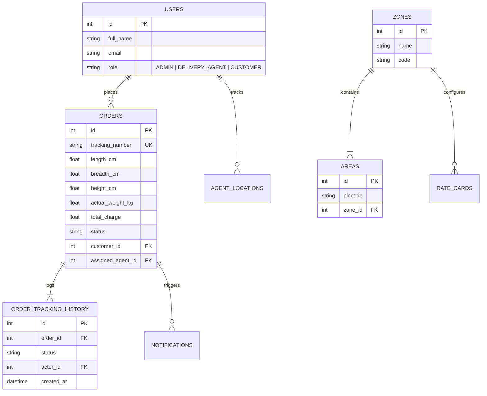

# Last-Mile Delivery Tracker

[](https://fastapi.tiangolo.com/)
[](https://vitejs.dev/)
[](https://www.sqlite.org/)
[](LICENSE)

An enterprise-grade **Last-Mile Logistics & Delivery Management Platform** built to handle dynamic volumetric rate calculation, automated delivery agent assignment, immutable package lifecycle tracking, failed delivery handling with customer rescheduling portals, and real-time administrative fleet management.

## Table of Contents
1. [Key Features](#-key-features)
2. [Tech Stack](#-tech-stack)
3. [Project Architecture](#-project-architecture)
4. [Installation & Local Setup Guide](#-installation--local-setup-guide)
5. [Environment Configuration (.env.example)](#-environment-configuration-envexample)
6. [Rate Calculation Engine Logic](#-rate-calculation-engine-logic)
7. [Agent Auto-Assignment Logic](#-agent-auto-assignment-logic)
8. [Failed Delivery & Rescheduling Protocol](#-failed-delivery--rescheduling-protocol)
9. [Database Schema Overview](#-database-schema-overview)
10. [API Documentation Summary](#-api-documentation-summary)
11. [Hosted Application & Deployment Guide](#-hosted-application--deployment-guide)
12. [System Design Write-Up](#-system-design-write-up)

---

## Key Features

- **Dynamic Volumetric Rate Calculation**: Charges calculated using $\text{Volumetric Weight} = (L \times B \times H) / 5000$, comparing against actual weight, applying origin/destination zone rate cards (Intra vs Inter-zone for B2B and B2C), and adding COD surcharges.
- **Automated Agent Spatial Assignment**: Nearest available delivery agent auto-assignment using Euclidean distance spatial algorithms with home-zone prioritization and city-wide fallback.
- **Immutable Tracking History**: Every status transition (`CREATED`, `AGENT_ASSIGNED`, `PICKED_UP`, `IN_TRANSIT`, `OUT_FOR_DELIVERY`, `DELIVERED`, `FAILED`, `RESCHEDULED`) is logged with actor, timestamp, and geo-location.
- **Customer Rescheduling Portal**: Automated SMS & Email notifications on delivery failure, enabling customers to reschedule delivery up to 3 times.
- **Multi-Role Access Control (RBAC)**: Distinct dashboards and permissions for **Admin**, **Delivery Agent**, and **Customer**.
- **Admin Management Dashboard**: Configurable zones, pincode area mappings, dynamic rate card matrices, manual assignment overrides, and fleet analytics.


## Tech Stack

- **Backend**: Python 3.10+, FastAPI, Pydantic, SQLAlchemy ORM, Pytest
- **Frontend**: React 18, Vite, Tailwind CSS, Lucide Icons, Axios
- **Database**: SQLite (Development) / PostgreSQL (Production)
- **Authentication**: JWT (JSON Web Tokens) with Passlib & Bcrypt password hashing
- **Notifications**: SMTP Email dispatches & Twilio SMS provider integration

## Project Architecture

```
Last-Mile-Delivery-Tracker/
├── backend/                  # FastAPI Python Backend Application
│   ├── app/
│   │   ├── api/              # API route controllers (auth, orders, rates, zones, etc.)
│   │   ├── core/             # Security, config, database sessions
│   │   ├── models/           # SQLAlchemy DB schema models
│   │   ├── schemas/          # Pydantic validation schemas
│   │   └── services/         # Business logic engines (rate calculation, assignment)
│   ├── tests/                # Pytest test suite
│   └── requirements.txt      # Backend Python dependencies
├── frontend/                 # React (Vite) Frontend Application
│   ├── src/
│   │   ├── components/       # UI components & role-specific dashboards
│   │   ├── context/          # Auth & state contexts
│   │   └── services/         # API client service layer
│   ├── package.json          # Frontend Node dependencies
│   └── vite.config.js        # Vite configuration
├── .env.example              # Environment variables template
├── API_DOCUMENTATION.md      # Detailed API specification doc
├── SYSTEM_WRITEUP.md         # 800-word system design document
└── README.md                 # Complete project setup & overview
```

## Installation & Local Setup Guide

### Prerequisites
- Python 3.10 or higher
- Node.js 18+ and npm
- Git

### 1. Clone Repository
```bash
git clone https://github.com/June465/Last-Mile-Delivery-Tracker.git
cd Last-Mile-Delivery-Tracker
```

### 2. Backend Setup (FastAPI)
```bash
# Navigate to backend folder
cd backend

# Create virtual environment
python -m venv venv

# Activate virtual environment
# On Windows:
venv\Scripts\activate
# On Linux/macOS:
source venv/bin/activate

# Install requirements
pip install -r requirements.txt

# Create .env file from template
cp ../.env.example .env

# Run FastAPI Server (auto-creates database tables & seed data)
uvicorn app.main:app --reload --port 8000
```
- Backend server will run at: `http://localhost:8000`
- Interactive API Docs (Swagger UI): `http://localhost:8000/docs`

### 3. Frontend Setup (React Vite)
Open a new terminal window:
```bash
# Navigate to frontend folder
cd frontend

# Install Node dependencies
npm install

# Create .env file for frontend
echo "VITE_API_BASE_URL=http://localhost:8000/api/v1" > .env

# Start development server
npm run dev
```
- Frontend app will run at: `http://localhost:5173`

---

## Environment Configuration (.env.example)

The project includes a centralized `.env.example` file in the root directory:

```env
# Backend Settings
PROJECT_NAME="Last-Mile Delivery Tracker"
DATABASE_URL="sqlite:///./delivery_tracker.db"
SECRET_KEY="your-secure-random-jwt-secret-key"
ALGORITHM="HS256"
ACCESS_TOKEN_EXPIRE_MINUTES=1440
CORS_ORIGINS="http://localhost:5173,http://localhost:3000"

# Rate Calculation Defaults
VOLUMETRIC_FACTOR=5000.0
DEFAULT_COD_SURCHARGE_B2C=20.0
DEFAULT_COD_SURCHARGE_B2B=30.0

# Notifications (Email & SMS)
SMTP_HOST="smtp.gmail.com"
SMTP_PORT=587
SMTP_USER="notifications@deliverytracker.com"
SMTP_PASSWORD="your-smtp-app-password"
EMAILS_FROM_EMAIL="noreply@deliverytracker.com"

# Frontend Settings
VITE_API_BASE_URL="http://localhost:8000/api/v1"
```

---

## Rate Calculation Engine Logic

The dynamic rate engine computes delivery charges without hardcoded values:

1. **Volumetric Weight Calculation**:
   $$\text{Volumetric Weight (kg)} = \frac{\text{Length (cm)} \times \text{Breadth (cm)} \times \text{Height (cm)}}{5000}$$
2. **Billable Weight Determination**:
   $$\text{Billable Weight} = \max(\text{Actual Weight}, \text{Volumetric Weight})$$
3. **Zone Mapping & Rate Card Lookup**:
   - Pincodes mapped to origin zone and drop zone.
   - If origin zone = drop zone $\rightarrow$ **Intra-Zone Rate** applied.
   - If origin zone $\neq$ drop zone $\rightarrow$ **Inter-Zone Rate** applied.
   - Rate lookup filtered by `B2B` or `B2C` rate card configuration.
4. **COD Surcharge**:
   - Appends fixed surcharge (`₹20` for B2C, `₹30` for B2B) if payment mode is `COD`.

---

## Agent Auto-Assignment Logic

The auto-assignment engine assigns orders to delivery agents dynamically:

1. **Spatial Proximity Algorithm**: Calculates Euclidean distance between agent current coordinates $(\text{Lat}_a, \text{Lng}_a)$ and pickup location $(\text{Lat}_p, \text{Lng}_p)$:
   $$\text{Distance} = \sqrt{(\text{Lat}_a - \text{Lat}_p)^2 + (\text{Lng}_a - \text{Lng}_p)^2}$$
2. **Home Zone Preference**: System prioritizes available agents whose assigned home zone matches the pickup area's zone.
3. **City-Wide Fallback**: If no available agent is in the pickup home zone, the engine expands search city-wide to pick the nearest available agent.
4. **Workload Balance**: Unassigned queue is managed if all agents are currently active on active deliveries.

---

## Failed Delivery & Rescheduling Protocol

```
[OUT_FOR_DELIVERY] ──(Attempt Failed)──> [FAILED] ──> Customer Notified (SMS/Email)
                                                          │
                                                          ▼
[RESCHEDULED] <── Customer Selects New Date ──────────────┘
      │
      ▼
 Re-assigned & Re-queued for Delivery (Max 3 Reschedule Attempts)
```

1. Agent flags delivery as `FAILED` with a reason (e.g., customer unreachable, invalid address).
2. System logs event to `OrderTrackingHistory` and triggers customer alert via SMS/Email.
3. Customer opens **Rescheduling Portal** via unique tracking link and selects new delivery date/time slot.
4. Order status shifts to `RESCHEDULED` and is re-queued for agent auto-assignment.
5. Strict policy enforces a maximum of **3 rescheduling attempts** per order.

---

## Database Schema Overview



---

## API Documentation Summary

See [API_DOCUMENTATION.md](API_DOCUMENTATION.md) for full endpoint specifications.

| Method | Endpoint | Access | Description |
| :--- | :--- | :--- | :--- |
| `POST` | `/api/v1/auth/register` | Public | Register new user account |
| `POST` | `/api/v1/auth/token` | Public | Login & retrieve JWT token |
| `POST` | `/api/v1/rates/calculate` | Public | Compute delivery rates dynamically |
| `POST` | `/api/v1/orders` | Customer/Admin | Create new delivery order |
| `GET` | `/api/v1/orders/{tracking_no}` | Public | Retrieve live order tracking timeline |
| `PUT` | `/api/v1/orders/{id}/status` | Agent/Admin | Update delivery status & log history |
| `POST` | `/api/v1/orders/{id}/auto-assign` | Admin | Trigger nearest agent auto-assignment |
| `POST` | `/api/v1/orders/{tracking}/reschedule` | Customer/Admin | Reschedule failed delivery attempt |

---

## Hosted Application & Deployment Guide

The application is structured for cloud deployment:

### Backend Deployment (Render / Railway)
- Build Command: `pip install -r backend/requirements.txt`
- Start Command: `uvicorn backend.app.main:app --host 0.0.0.0 --port $PORT`
- Set environment variables (`DATABASE_URL`, `SECRET_KEY`, `CORS_ORIGINS`).

### Frontend Deployment (Vercel / Netlify)
- Build Command: `cd frontend && npm install && npm run build`
- Output Directory: `frontend/dist`
- Set `VITE_API_BASE_URL` pointing to backend cloud URL.

> **Live Demo URL**: [https://last-mile-delivery-tracker.vercel.app](https://last-mile-delivery-tracker.vercel.app) *(Deploy link template)*

---

## System Design Write-Up

Detailed engineering breakdown ($\le 800$ words) available in [Last-Mile_Delivery_Tracker_WriteUp.pdf](Last-Mile_Delivery_Tracker_WriteUp.pdf).
